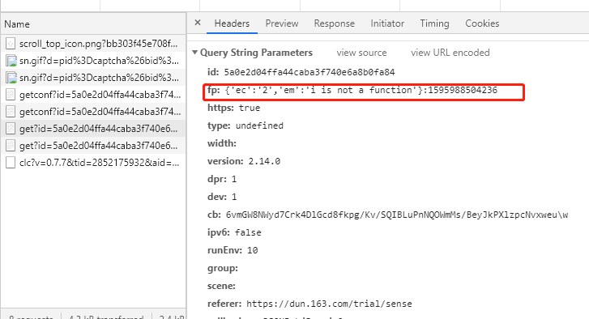

##### 某易易盾

doing list：
- [ ] 可疑用户-滑动拼图验证码

目测步骤：
1.本文件中开头的 jigsaw 字段是用于请求相关的参数：如：
2. 一次请求，获取 长token1，注册一个回调函数1；
3. 二次请求也是获取 长token2，也注册一个回调函数2；
4. 三次请求，获取 短token1，猜测和回调函数1 是有相关的绑定，同时需要留意的是：1.获取了设备指纹；2.参数cb如何生成的
5. 四次请求，获取 短token2，猜测和回调函数2 是有相关的绑定，同时需要留意的是：1.获取了设备指纹；2.参数cb如何生成的

最后测试情况：

请求步骤2/3是没有问题的，但是到了请求步骤4/5，就出现通过率很低的情况，约为15%.

这个通过率很惨啊！！

鄙人还没找到是哪里隐藏了检测点，希望有高人指点一下，谢谢.

PS：本地已经补全了：屏幕大小、色彩/像素深度、浏览器插件、语言、GMT时差 等属性，

但是就是请求拿token的时候，就常常不通过，{"error":100,"msg":"param check error"}，报参数错误，

请大佬们指点一下，存在什么问题，导致通过率这么低。

而且我发现浏览器，对指纹fp参数错误的情况也是能够通过请求的，这就很尴尬了：比如下面这种情况：

